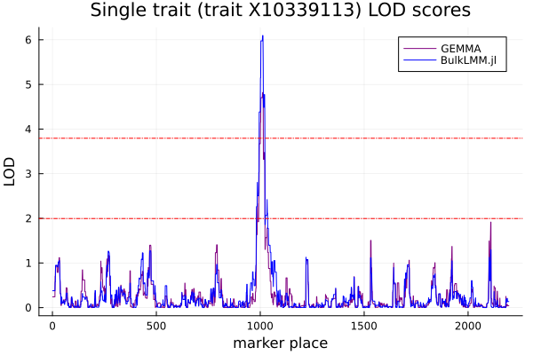
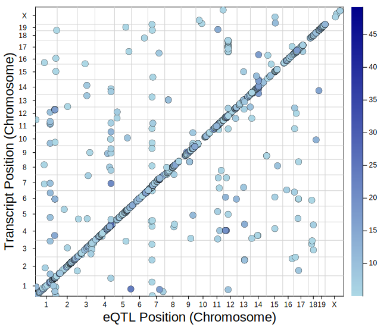

# BulkLMM.jl

Julia package for performing genome scans for multiple traits ("in
bulk") using linear mixed models (LMMs). Suitable for eQTL mapping
with thousands of traits and markers.  Also performs permutation
testing for LMMs taking into account the relatedness of individuals.
We use multi-threading and matrix operations to speed up computations.

The current implementation is for genome scans with one-degree of
freedom tests without any background covariates.  Future releases will
cover those scenarios.

## Linear Mixed Model (LMM)

We consider that case when a univariate trait of interest is measured
in a population of related individuals with kinship matrix $K$.  Let
the trait vector, $y$ follow the following linear model.

$$ y = X\beta + \epsilon,$$

where 

$$V(\epsilon) = \sigma^2_g K+\sigma^2_e I.$$

where $X$ is a matrix of covariates which would include the intercept,
candidate genetic markers of interest, and any background covariates.
The variance components $\sigma^2_g$ and $\sigma^2_e$ denote the
genetic and random error variance components respectively.

### Single trait scan

For a single trait and candidate marker, we use a likelihood ratio
test to compare a model with and without the candidate genetic marker
(and including the intercept and all background covariates).  This
process is repeated for each marker to generate the genome scan.  The
result is reported in LOD (log 10 of likelihood ratio) units.

Users can specify if the variance components should be estimated using
ML (maximum likelihood) or REML (restricted maximum likelihood).  The
scans can be performed with the variance components estimated once
under the null, or separately for each marker.  The latter approach is
slower, but more accurate.

### Permutation tests for single trait

Under the null hypothesis that no individual genetic marker is
associated with the trait, traits are correlated according if the
kinship matrix is not identity, and the genetic variance component is
non-zero.  Thus, a standard permutation test whene we shuffle the
trait data randomly, is not appropriate.  Instead, we rotate the data
using the eigendecomposition of the kinship matrix, which
de-correlates the data, and then shuffle the data after rescaling them
by their standard deviations.

### Scans for multiple traits

Scans for multiple traits are performed by running univariate LMMs for
each combination of trait and marker.  We are exploring algorithms for
optimizing this process by judicious use of approximations.

### Multi-threading

This package uses multi-threading to speed up some operations.  You
will have to start Julia with mutliple threads to take advantage of
this.  You should use as many threads as your computer is capable of.
Further speedups may be obtained by spreading (distributing) the
computation across mutliple computers.

## Example: application on BXD spleen expression data

We demonstrate basic usage of `BulkLMM.jl` through an example applying
the package on the BXD mouse strains data.

First, after successfully installed the package, load it to the
current *Julia* session by

```julia
using BulkLMM
```

The BXD data are accessible through our published [github
repo](https://github.com/senresearch/BulkLMM.jl) of the `BulkLMM.jl`
package as .csv files under the `data/bxdData` directory.

The raw BXD traits `BXDtraits_with_missing.csv`contains missing
values. After removing the missings, load the BXD traits data

```julia
pheno_file = "data/bxdData/spleen-pheno-nomissing.csv";
pheno = readdlm(pheno_file, ',', header = false);
pheno_processed = pheno[2:end, 2:(end-1)].*1.0; # exclude the header, the first (transcript ID)and the last columns (sex)
```

Required data format for traits should be .csv or .txt files with
values separated by `','`, with each column being the observations of
$n$ BXD strains on a particular trait and each row being the
observations on all $m$ traits of a particular mouse strain.

Also load the BXD genotypes data. The raw BXD genotypes file
`BXDgeno_prob.csv` contains even columns that each contains the
complement genotype probabilities of the column immediately preceded
(odd columns). Calling the function `readBXDgeno` will read the BXD
genotype file excluding the even columns.

```julia
geno_file = "data/bxdData/spleen-bxd-genoprob.csv"
geno = readdlm(geno_file, ',', header = false);
geno_processed = geno[2:end, 1:2:end] .* 1.0;
```

Required data format for genotypes should be .csv or .txt files with
values separated by `','`, with each column being the observations of
genotype probabilities of $n$ BXD strains on a particular marker place
and each row being the observations on all $p$ marker places of a
particular mouse strain.

For the BXD data, 


```julia
size(pheno_processed) # (number of strains, number of traits)
```


    (79, 35556)


```julia
size(geno_processed) # (number of strains, number of markers)
```


    (79, 7321)


Compute the kinship matrix $K$ from the genotype probabilities using the function `calcKinship` 

```julia
kinship = calcKinship(geno_processed); # calculate K
```

### Single trait scanning:

For example, to conduct genome-wide association mappings on the
1112-th trait, ran the function `scan()` with inputs of the trait (as
a 2D-array of one column), geno matrix, and the kinship matrix.


```julia
traitID = 1112;
pheno_y = reshape(pheno_processed[:, traitID], :, 1);
```


```julia
@time single_results = scan(pheno_y, geno_processed, kinship);
```

      0.059480 seconds (80.86 k allocations: 47.266 MiB)


The output structure `single_results` stores the model estimates about the variance components (VC, environmental variance, heritability estimated under the null intercept model) and the lod scores. They are obtainable by


```julia
# VCs: environmental variance, heritability, genetic_variance/total_variance
(single_results.sigma2_e, single_results.h2_null)
```


    (0.0942525841453798, 0.850587848871709)


```julia
# LOD scores calculated for a single trait under VCs estimated under the null (intercept model)
single_results.lod; 
```

`BulkLMM.jl` supports permutation testing for a single trait GWAS. Simply run the function `scan_perms_lite()` with the number of permutations required as the input `nperms`: 


```julia
@time single_results_perms = scan_perms_lite(pheno_y, geno_processed, kinship; nperms = 1000, original = false);
```

      0.079464 seconds (94.02 k allocations: 207.022 MiB)


(use the input `original = false` to suppress the default of computations of LOD scores on the original trait)

The output `single_results_perms` is a matrix of LOD scores of dimension `p * nperms`, with each column being the LOD scores of the $p$ markers on a permuted copy and each row being the marker-specific LOD scores on all permuted copies.


```julia
size(single_results_perms)
```


    (7321, 1000)


```julia
max_lods = vec(mapslices(x -> maximum(x), single_results_perms; dims = 1));
```


```julia
thrs = map(x -> quantile(max_lods, x), [0.05, 0.95]);
```

Plot the LOD scores in comparison with
[GEMMA](https://github.com/genetics-statistics/GEMMA) (needs to run
GEMMA to generate outputs elsewhere), as well as the LOD rejection
thresholds from permutation testing:
    



### Multiple traits scanning:

To get LODs for multiple traits, for better runtime performance, first
start *julia* with multiple threads following [Instructions for
starting Julia REPL with
multi-threads](https://docs.julialang.org/en/v1/manual/multi-threading/)
or switch to a multi-threaded *julia* kernel if using Jupyter
notebooks.

Then, run the function `scan_lite_multivar()` with the matrices of
traits, genome markers, kinship. The fourth required input is the
number of parallelized tasks and we recommend it to be the number of
*julia* threads.

Here, we started a 16-threaded *julia* and executed the program on a
Linux server with the Intel(R) Xeon(R) Silver 4214 CPU @ 2.20GHz to
get the LOD scores for all **~35k** BXD traits:


```julia
@time multiple_results_allTraits = scan_lite_multivar(pheno_processed, geno_processed, kinship, Threads.nthreads());
```

     82.421037 seconds (2.86 G allocations: 710.821 GiB, 41.76% gc time)


The output `multiple_results_allTraits` is a matrix of LOD scores of dimension $p \times n$, with each column being the LOD scores from performing GWAS on each given trait.


```julia
size(multiple_results_allTraits)
```

    (7321, 35556)

To visualize the multiple-trait scan results, we can use the plotting utility function `plot_eQTL`to generate the eQTL plot. The function `plot_eQTL` does not belong to `BulkLMM.jl`; it will be part of the future package specialized for visualizations. However, we can easily have access to the plotting function by running the following commands:

```julia
using RecipesBase, Plots, Plots.PlotMeasures, ColorSchemes
include(joinpath(pathof(Bulklmm),"../..", "plot_utils", "visuals_utils.jl"));
```

For the following example, we only plot the LOD scores that are above 5.0 by calling the function and specifying in the optional argument `thr = 5.0`:

Note: one will need to read in the `gmap.csv` and the `phenocovar.csv` under `data/bxdData/` directory as

```julia
gmap_file = "BulkLMM.jl/data/bxdData/gmap.csv";
gInfo = CSV.read(gmap_file, DataFrame);
phenocovar_file = "BulkLMM.jl/data/bxdData/phenocovar.csv";
pInfo = CSV.read(phenocovar_file, DataFrame);
```

Also, in the input argument one will also need to supply the `pheno` input data in the argument.

```julia
plot_eQTL(multiple_results_allTraits, pheno, gInfo, pInfo; thr = 5.0)
```




## Installation:

The package `BulkLMM.jl` can be installed by running

```julia
using Pkg
Pkg.add("BulkLMM")
```

To install from the **Julia** REPL, first press `]` to enter the Pkg
mode and then use:

```
add BulkLMM
```

The most recent release of the package can be obtained by running 

```julia
using Pkg
Pkg.add(url = "https://github.com/senresearch/BulkLMM.jl", rev="main")
```

## Contact and feedback

If you find any bugs, please post an issue on GitHub or contact the
maintainers directly.


Check out NEWS.md to see what's new in each `BulkLMM.jl` release.
